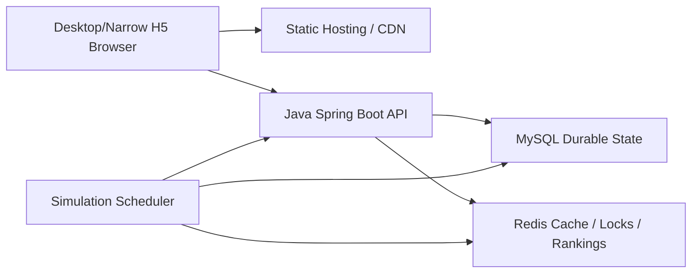

# Technical Plan: H5 + Java Backend Migration

Feature: 001-h5-java-backend-migration
Status: Draft
Created: 2026-06-06

## Architecture Decision

Build a modular monolith backend and a responsive desktop-first H5 frontend.

The first release should be a server-authoritative menu RPG. Phaser is optional and should be introduced only for a battle scene when real-time or richer 2D presentation is needed. This keeps the account, inventory, quest, market, leaderboard, and chat systems simple to ship and maintain while using desktop web space for richer multi-panel UI.

## Recommended Stack

### Frontend

- Language: TypeScript.
- Build: Vite.
- UI: React.
- State: Zustand for local UI state; TanStack Query for server state.
- Routing: React Router or TanStack Router. Choose one during scaffold and record the ADR.
- Styling: source-owned CSS or CSS modules; keep design system tokens in source.
- Testing: Vitest, Testing Library, Playwright.
- Game rendering: Phaser only for battle scenes that need Canvas. Lazy-load it outside normal menu routes.
- Layout posture: desktop-first responsive workbench; narrow-screen fallback is required, but desktop must not be a phone-shaped vertical shell.

### Backend

- Runtime: Java LTS.
- Framework: Spring Boot modular monolith.
- Build: Maven or Gradle; choose one at scaffold time and keep the repo consistent.
- Persistence: MySQL, Flyway migrations, MyBatis/MyBatis-Flex or jOOQ for explicit SQL.
- Cache and coordination: Redis, Spring Data Redis, Redisson.
- Auth: Spring Security, JWT access token, refresh token, password hashing with Argon2id or BCrypt.
- API docs: OpenAPI generated from backend controllers or contract files.
- Tests: JUnit 5, AssertJ, unit tests for domain logic, and an opt-in local integration profile against locally installed MySQL/Redis. WireMock only if external services appear.

Version posture:

- Prefer current stable major versions at scaffold time.
- If Spring Boot 4 + Java 25 ecosystem compatibility is clean, use that for a greenfield backend.
- If dependencies or deployment images are not ready, use Java 21 with a Spring Boot 3.5/4.0-compatible path and record the reason.
- Prefer MySQL 8.4 LTS for ecosystem stability unless deployment platform support makes newer MySQL LTS clearly safer.
- Prefer Redis 8.x GA; pin exact minor in deployment files.
- Local development MUST use local MySQL and Redis services. Do not use Docker Compose for this project unless the constraint is explicitly changed.

## Backend Module Boundaries

Keep one deployable service with package-level modules:

- `auth`: account, credentials, sessions, token refresh.
- `config`: versioned config bundles, startup validation, config lookup.
- `player`: character creation, stats, level, combat power.
- `inventory`: item instances, bag slots, equipment slots, sell, bulk sell by quality, organize, enhance.
- `dungeon`: dungeon selection, round battle simulation, failure/partial progress, sweep, reward commit.
- `quest`: quest progress, daily reset, reward claim.
- `market`: listing, purchase, cancel, expiry, trade records.
- `leaderboard`: player ranks, robot ranks, Redis sorted sets.
- `chat`: player messages, bot/system messages, unread state.
- `simulation`: scheduled robot market/chat/leaderboard advancement.
- `audit`: economy events, idempotency records, admin investigation support.
- `admin`: internal config and player inspection APIs, later milestone.

## Data Model Outline

Core tables:

- `account`: login identity and credential metadata.
- `player`: character identity, profession, level, exp, base stats.
- `wallet`: player currencies with optimistic version.
- `item_template_snapshot`: optional persisted template snapshots by config version.
- `item_instance`: unique item, owner, template id, rolled stats, quality, enhancement, lock state.
- `inventory_slot`: player bag slot to item mapping.
- `equipment_slot`: player equipped slot to item mapping.
- `dungeon_run`: run request, config version, result, rewards, idempotency key.
- `quest_progress`: per-player quest status and counters.
- `market_listing`: item listing lifecycle.
- `market_trade_record`: immutable trade history.
- `chat_message`: durable chat/system messages.
- `robot_profile`: stable robot personality and identity.
- `robot_snapshot`: current robot level, power, gear summary, market state.
- `config_bundle`: config version, checksum, activation time.
- `economy_audit_event`: immutable player-affecting economic event.
- `idempotency_record`: request id, player id, operation, result hash, expiry.

All economy tables need `created_at`, `updated_at`, and optimistic `version` where mutable.

## Redis Usage

Suggested keys:

- `session:{sessionId}`: refresh/session metadata.
- `idempotency:{playerId}:{operation}:{requestId}`: duplicate request protection.
- `lock:player:{playerId}`: short operation lock for item/currency mutations.
- `leaderboard:power`: player combat power sorted set.
- `leaderboard:robot-power`: robot combat power sorted set.
- `chat:guild:recent`: recent message list.
- `market:hot-listings`: cache for market browse.
- `rate:{scope}:{identity}`: login, chat, market, and dungeon rate limits.

Redis must be treated as acceleration and coordination. MySQL remains the final authority.

## API Shape

Initial REST endpoints:

- `POST /api/auth/register`
- `POST /api/auth/login`
- `POST /api/auth/refresh`
- `GET /api/session/me`
- `POST /api/players`
- `GET /api/game/home`
- `GET /api/config/bootstrap`
- `GET /api/inventory`
- `POST /api/inventory/equip`
- `POST /api/inventory/sell`
- `POST /api/inventory/bulk-sell`
- `POST /api/inventory/organize`
- `POST /api/inventory/enhance`
- `GET /api/dungeons`
- `POST /api/dungeons/{dungeonId}/runs`
- `POST /api/dungeons/{dungeonId}/sweep`
- `GET /api/quests`
- `POST /api/quests/{questId}/claim`
- `GET /api/market/listings`
- `POST /api/market/listings`
- `POST /api/market/listings/{listingId}/buy`
- `POST /api/market/listings/{listingId}/cancel`
- `GET /api/leaderboard/power`
- `GET /api/chat/messages`
- `POST /api/chat/messages`

Use WebSocket or SSE later for chat and market push. Polling is acceptable for the first H5 milestone.

## Game Authority Rules

- Client sends intent, not final state.
- Backend snapshots player/equipment/config at operation start.
- Backend validates ownership, level, slot, currency, cooldown, and config version.
- Backend commits rewards and writes audit event in the same transaction.
- Backend returns a view model suitable for immediate UI rendering.
- Dungeon runs can fail. Completed-dungeon quest progress is recorded only on successful runs; kill and loot progress can be recorded from partial runs.
- Inventory bulk sell receives selected qualities and optional item type filters from the client, but backend remains authoritative for ownership and slot membership.

## UI Architecture Rules

See `specs/001-h5-java-backend-migration/ui-design.md` for durable UI design rules.

Current desktop layout strategy:

- Home: header/resource strip plus two-column workbench.
- Inventory: three-column workbench with equipped/status, item grid, and tool panel.
- Dungeon: multi-column dungeon grid with risk labels.
- Battle result: summary/loot left, battle log right.
- Chat: fixed-height chat workspace; message history scrolls internally; input remains visible.
- Leaderboard/quest/market: summary strip plus internal-scroll multi-column list.

## Config Strategy

Initial migration can copy current JSON files from `MythicRealm/MythicRealm/Resources/` into backend resources. Add:

- JSON schema validation.
- `config_bundle` table with checksum and active version.
- `/api/config/bootstrap` for frontend display labels and static previews.
- Golden tests for formulas and example dungeon results.

Avoid admin-editable live config until audit, rollback, and validation are ready.

## Migration Phases

### Phase 0: Spec Kit Foundation

- Add constitution, project context, migration spec, plan, and tasks.
- Align README and progress docs with the new migration direction.

### Phase 1: Backend and H5 Skeleton

- Create backend app, frontend app, local MySQL/Redis setup scripts, CI scripts.
- Port config loading and validation.
- Build login, create character, and home snapshot flow.

### Phase 2: Character, Inventory, Equipment

- Implement player stats, item instances, inventory, equipment, combat power.
- Build H5 inventory and character panels.

### Phase 3: Dungeon and Rewards

- Port battle formulas and loot generation.
- Implement dungeon run and sweep APIs with idempotency.
- Build dungeon list/detail/result UI with log playback.

### Phase 4: Quest, Market, Chat, Leaderboard

- Implement quest progress and rewards.
- Implement market transactions and bot listings.
- Implement world chat and robot/system messages.
- Implement leaderboard with Redis sorted sets and durable snapshots.

### Phase 5: Web UI Polish and Optional Phaser

- Improve desktop web density, internal scrolling, narrow-screen fallback, transitions, loading states, and offline retry behavior.
- Add optional Phaser battle scene if the game needs richer action presentation.

### Phase 6: Operations

- Add admin inspection APIs, backup/restore runbook, observability, production deployment manifests.

## Test Strategy

- Domain unit tests: stats, combat power, battle result, loot, enhancement, quest, market pricing.
- Transaction tests: buy/list/cancel/claim under concurrent requests.
- API integration tests against local MySQL and Redis using an explicit integration-test profile.
- Frontend component tests for inventory, quest, market, and chat.
- Playwright smoke tests for register -> create character -> run dungeon -> equip loot.
- Golden sample tests against known JSON configs.

## Risks and Mitigations

| Risk | Mitigation |
| --- | --- |
| Scope expands into full MMO | Keep first milestone server-authoritative but not real-time multiplayer. |
| Economy duplication bugs | Idempotency keys, MySQL constraints, transaction tests, audit events. |
| Phaser slows H5 delivery | Lazy-load Phaser only after menu RPG flow is shippable. |
| Config drift from Swift | Use config checksums, golden tests, and explicit migration notes. |
| Bot simulation becomes expensive | Bound offline catch-up and compress old simulation intervals. |
| Docs drift from code | Update active spec or add drift task before implementation continues. |

## Open Questions

- Should the first backend use Maven or Gradle?
- Should exact backend target be Spring Boot 4 + Java 25, or Java 21 for maximum dependency conservatism?
- Should player accounts support guest mode in the first H5 release?
- Should old iOS local saves be imported for internal testing only?
- Is battle log playback acceptable for the first public H5 release?
